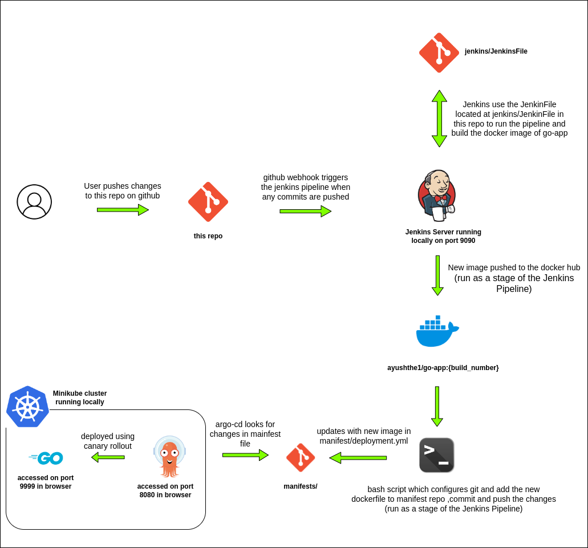
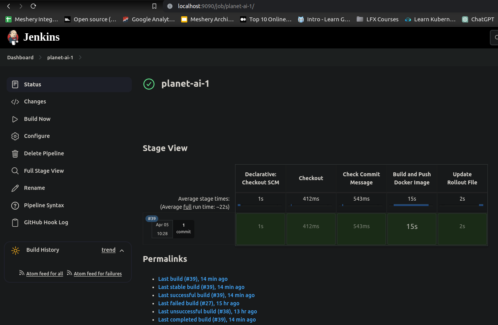
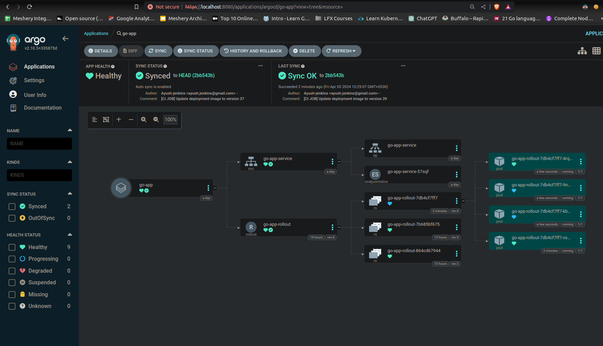
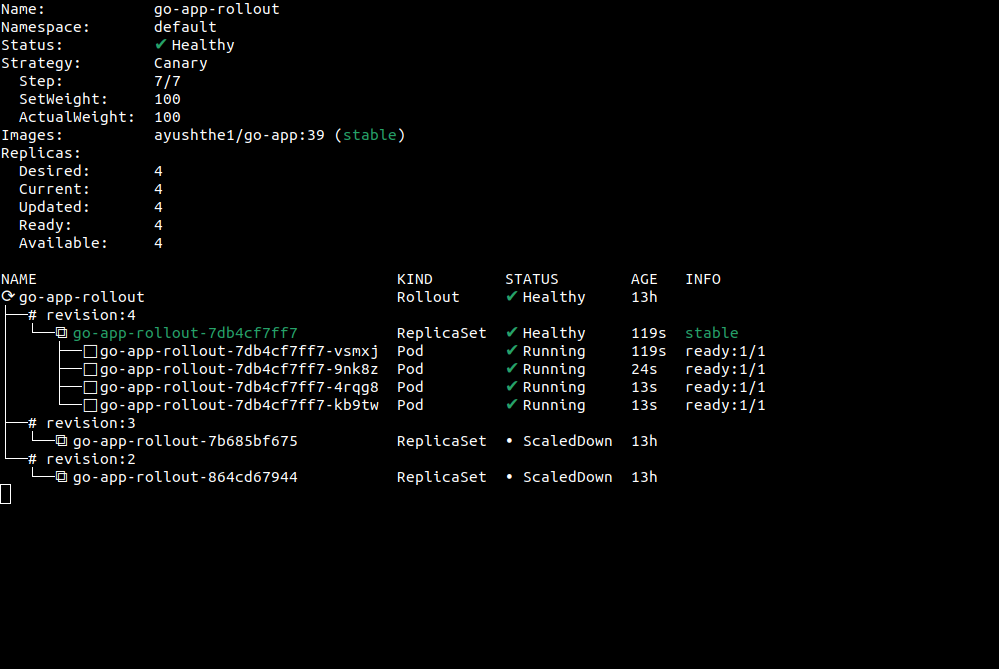

# Dockerized Golang Web App with Jenkins CI/CD and ArgoCD Kubernetes Deployments

In this project, I dockerized a Golang web application and set up a local Jenkins server with a Minikube cluster containing ArgoCD for Kubernetes deployments. Utilizing a Jenkins pipeline triggered by webhooks upon new commits, the pipeline automates image building, pushing to DockerHub, and updating manifest files. ArgoCD monitors changes in the manifests directory, facilitating smooth deployments using Argo Rollout with canary strategies.

This repository consists of 3 directories. 
* `go-app/` - This contains the code for a simple go web application and its Dockerfile.
* `jenkins` - This contains a single file called JenkinsFile which is used by the Jenkins server to run the pipeline.
* `manifests` - This consists of 2 files, rollout.yml & service.yml.

## Steps taken 

1) **Golang Web App and Dockerfile**:

   Made a simple Golang web app. Its code resides in the `go-app/` directory, accompanied by a Dockerfile to build its image.

2) **Local Jenkins Server Setup**:
   - Configured a local Jenkins server to run on port 9090.
   - Installed necessary plugins and set up credentials for DockerHub and GitHub access.

&nbsp;

3) **Jenkins Pipeline (JenkinsFile)**:
    Defined a JenkinsFile (`jenkins/JenkinsFile`) orchestrating multiple stages:
     - Building the Golang web app image via Dockerfile.
     - Pushing the image to DockerHub.
     - Updating the `manifests/rollout.yml` file to reference the latest image.
     - Committing changes to this repository.
    
    &nbsp;

4) **ArgoCD Installation and Configuration**:
   - Installed ArgoCD and argo-rollout on a Kubernetes cluster following official documentation.
   - Exposed `argocd-server` on port 8080 for browser access.

&nbsp;

5) **ArgoCD Application Deployment**:
   - Utilized the ArgoCD UI to create a new application monitoring manifest files (`rollout.yml`) in the `manifests/` directory.
   - Enabled automatic deployment of new versions using the canary deployment strategy outlined in `rollout.yml`.
   - Access the deployed Golang web app on port 9999 in the browser (tunnel creation required).

    &nbsp;
6) **GitHub Webhook Configuration**:
   - Configured a GitHub webhook within repository settings to notify the local Jenkins server of new commits, triggering the pipeline.
   - Used Ngrok to expose the local Jenkins server securely to the public internet, facilitating webhook notifications.

    &nbsp;
7) **CI/CD Pipeline**:
   - Established a robust CI/CD pipeline where any commits pushed to the repository trigger the Jenkins server via the webhook.
   - The pipeline builds and pushes the new image to DockerHub, updating the `rollout.yml` file.
   - ArgoCD detects changes in the manifest file, automatically syncing to deploy the latest image version using canary deployment.

## Output Screenshots

* **Jenkins Pipeline**

* **ArgoCD Deployment**

* **Canary Deployment Rollout**

## Challenges Faced

### 1. Avoiding Infinite Loop in Jenkins Pipeline

**Problem:**
My Jenkins pipeline, triggered by a 'github hook trigger for GITScm polling', caused an infinite loop. The pipeline itself pushed commits to the GitHub repository whenever it updated the Docker image version in the `rollout.yml` file. Consequently, each push from the pipeline triggered the GitHub webhook, prompting the Jenkins server to rerun the pipeline.

**Solution:**
To address this issue, I introduced a new stage in my Jenkinsfile. This stage checks the commit message that triggered the pipeline. If the message contains `[CI JOB]`, the pipeline execution is aborted. Subsequently, any commits made by the Jenkins pipeline to the repository include the `[CI JOB]` keyword.

### 2. Configuring GitHub Webhook for Local Service Using Ngrok

**Problem:**
Setting up a GitHub webhook requires a payload URL to which notifications are sent when commits are pushed. As my Jenkins server runs on localhost, it lacks a live URL accessible over the internet.

**Solution:**
To resolve this challenge, I utilized [Ngrok](https://ngrok.com/), a tool for creating secure tunnels to local servers. Ngrok enables the exposure of a local server behind a NAT or firewall to the public internet over a secure tunnel. Acting as a reverse proxy, Ngrok forwards traffic from a publicly accessible endpoint to a specified port on the local machine.

---

## Cleanup

### 1. Remove the rollout and the associated resources

argocd app delete go-app-rollout --cascade

### 2. Uninstall argocd

kubectl delete -n argocd -f https://raw.githubusercontent.com/argoproj/argo-cd/stable/manifests/install.yaml

### 3. Uninstall argo-rollouts

kubectl delete -n argo-rollouts -f https://raw.githubusercontent.com/argoproj/argo-rollouts/stable/manifests/install.yaml
